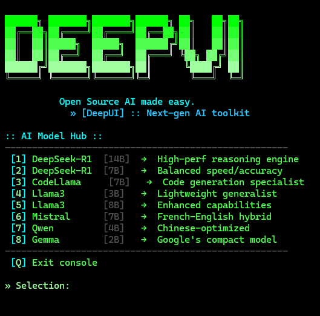

# DeepUI

**Open Source AI made easy.**

DeepUI is a sleek, terminal-based interface that gives you instant access to today's most powerful open-source AI models through Ollama with just a few keystrokes.

  

## ⚠️ Important Prerequisite

**This tool requires [Ollama](https://ollama.ai/) to be installed and running on your system.**

DeepUI is a frontend interface that connects to Ollama, which handles the actual AI model loading and execution. Without Ollama installed and properly configured, DeepUI will not function.

## ✨ Features

- **Stylish Console Interface**: Matrix-inspired terminal UI with a modern twist
- **One-Click AI Access**: Launch any supported model instantly via Ollama
- **Automatic Model Installation**: DeepUI will download models on demand - no manual setup required
- **Curated Model Selection**: Easy access to popular models available through Ollama
- **Zero Additional Configuration**: Works out of the box with your existing Ollama setup
- **Lightweight**: Minimal system requirements, runs on any modern Windows PC

## 🧠 Supported Models

DeepUI provides seamless access to cutting-edge open source AI models:

| Model | Size | Specialty |
|-------|------|-----------|
| DeepSeek-R1 | 14B | High-performance reasoning engine |
| DeepSeek-R1 | 7B | Balanced speed/accuracy |
| CodeLlama | 7B | Code generation specialist |
| Llama3 | 3B | Lightweight generalist |
| Llama3 | 8B | Enhanced capabilities |
| Mistral | 7B | French-English hybrid |
| Qwen | 4B | Chinese-optimized |
| Gemma | 2B | Google's compact model |

## 🚀 Getting Started

### Prerequisites

- Windows 10/11
- PowerShell 5.1 or later
- **[Ollama](https://ollama.ai/) installed and running**

### Installation and Setup

1. **Install Ollama** (if not already installed):
   - Download from [ollama.ai](https://ollama.ai/)
   - Follow the installation instructions for Windows

2. Clone this repository:
   git clone https://github.com/yourusername/deepui.git
3. Navigate to the DeepUI directory:
   cd deepui
4. Run the script:
   .\deepui.ps1
5. **Models will be automatically downloaded** when you select them for the first time

### Usage

1. Launch DeepUI from PowerShell
2. Select a model using the corresponding number
3. If the model isn't already installed, DeepUI will download it automatically
4. Interact with the AI in the terminal
5. Press Ctrl+C to exit the model
6. Press Enter to return to the model selection menu

## 🔄 How It Works

DeepUI is a PowerShell wrapper around Ollama that provides:
1. A user-friendly menu to select AI models
2. Automatic downloading and launching of the selected model through Ollama
3. A stylish, consistent interface for all your AI interactions

The actual AI processing is handled by Ollama running locally on your machine.

## 🔧 Customization

DeepUI can be easily customized by editing the script:

- Add new models by updating the model array
- Modify the color scheme by changing the ANSI color codes
- Adjust terminal appearance with PowerShell console settings

## 📋 Requirements

- PowerShell 5.1+
- Windows Terminal (recommended for best visual experience)
- Ollama installed (models will be downloaded automatically)

## 📝 License

This project is licensed under the MIT License - see the LICENSE file for details.

## 🤝 Contributing

Contributions are welcome! Feel free to submit a pull request or open an issue.

---

  <i>DeepUI - Where cyberpunk aesthetics meet cutting-edge AI</i>

